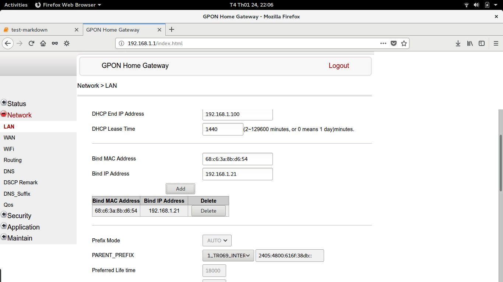

# Home-Lighting
```Why do we always seek for thing too far?```

I build a tiny system that people can use their smart phone to control light. Besides, my system also has an alarm feature, which notifies users to turn on/off light at specific times in a day.
#### Keyword: IOT, Smart home, ESP8266, Light control


Table of contents
=================
- [Home-Lighting](#home-lighting)
- [Table of contents](#table-of-contents)
- [I.Acknowledge](#iacknowledge)
- [II.Solution](#iisolution)
- [III.Prerequisites](#iiiprerequisites)
  * [III.1.Arduino IDE](#iii1arduino-ide)
  * [III.2.MIT App Inventor 2](#iii2mit-app-inventor-2)
- [IV.Design architecture](#ivdesign-architecture)
  * [IV.1.Overview](#iv1overview)
  * [IV.2.Hardware](#iv2hardware)
  * [IV.3.Firmware](#iv3firmware)
  * [IV.4.Software](#iv4software)
- [V.Deployment](#vdeployment)
- [VI.Result](#viresult)


I.Acknowledge
=============
* My house has two parts, the under and the upper. The former is centre of living, whilst, the latter has a light, which need to be turned on in the evening and turned off at night.
* When the whole of family members go out from the afternoon, we must turned on the light so that the front of our house can be bright in the evening. It is quite wasted.
* I and my younger sister have gone to city for studying, so there are just my parents at home. 
Therefore, I want to do something to assist my parents though my effort is trivial.


II.Solution
===========
* I decide to design an embedded system to help my parents turn on/off the light comfortably.
* Handy mode is still kept alongside to automatic mode.
* Users can not only control light via smart phone connecting to the Internet, but also see state of the light.


III.Prerequisites
=================
III.1.Arduino IDE
-----------------
To program ESP8266 NodeMCU, we can use Arduino IDE, which is a well known tool to every embedded programmers. In addition, it observes that Arduino IDE has an enermous community so that we can utilize supported libraries for saving time. However, as the default, Arduino IDE has has no ESP8266 NodeMCU package, so we need to feed it. [In this link](http://www.instructables.com/id/Programming-ESP8266-ESP-12E-NodeMCU-Using-Arduino-/), you can find a clear way to get this job by your own.

After Arduino IDE is installed the package, we go to verify whether Arduino IDE works well with ESP8266 NodeMCU. First, you must select NodeMCU board as the picture below. 


Then, you can open the "Blink" example to test if your Arduino IDE can work with NodeMCU.

If you use Linux and compile the sketch successfully but cannot download code into NodeMCU due to the "Denied Permission" error, that means the file corresponding to USB port, which you connect NodeMCU board into, has root permission. The solution will be opening Terminal and typing ```sudo chmod 666 /dev/ttyUSB0```. I assume that the file corresponding to USB port is ```/dev/ttyUSB0```.


III.2.MIT App Inventor 2
------------------------
MIT App Inventor 2 is an online service that you can create an Android application quickly and easily. To use this free service, you access [this link](http://services.appinventor.mit.edu/?locale=en) and register an account. Like many different application creator, MIT App Inventor 2 also has two part, Designer and Block. In the former, you drag checkbox, text, button, etc to make shape of the application. In the latter, back-end code will be required to run under the GUI made from the Designer part. It is too amazing that in the back-end code, you don't need to write any code because code is provided as blocks in MIT App Inventor 2, which assists user extremely.


IV.Design architecture
======================
IV.1.Overview
-------------
My system has three main objects: ***Micro-controller***, ***Light***, and ***Smart phone***.

***MCU*** is the heart of my system. It carries three core functions: Communicating with Smart phone via the Internet. Controlling light (on/off), following the request from Smart phone. Reading the state of light and telling this state to Smart phone.

***Smart phone*** plays as a GUI to users, which keeps two functions: Querying MCU to tell it the state of light. Sending control request to MCU to turn on/off the light.

***Light*** is the controlled object by MCU directly and by Smart phone indirectly.


IV.2.Hardware
-------------
From the picture in ***Overview***, I make it clearer with picure below to show hardware layer in my design architecture. There are some components: [NodeMCU](http://hshop.vn/products/kit-rf-thu-phat-wifi-esp8266-nodemcu-lua-v3-ch340), [RelayShield](http://hshop.vn/products/esp8266-nodemcu-lua-d1-mini-relay-shield), [CurrentSensor-ASC712](http://hshop.vn/products/cam-bien-dong-dien-hall-acs712-5a).

***NodeMCU***: Control ***Relay*** via pin D2, Read ADC signal from ***CurrentSensor*** through pin A0.

***Relay***: On/Off the light, based on the control signal from pin D2 of ***NodeMCU***.

***CurrentSensor***: Convert AC current to ADC signal so that ***NodeMCU*** can read and be aware of light state.


Why ***3-pole switch***? As I mentioned, I decide to design my system that can be run either on handy mode or automatic mode. Two modes must be absolutely separate from the other, which means the handy switch can be implemented independently to NodeMCU. From this clue, I remember to the stair circuit that each switch can control the light independently to the another.


Why ***CurrentSensor***? Because of the independent combination of handy-automatic mode, the NodeMCU cannot take the state of light into its own scope. As the result, the NodeMCU must try to read the state of light, but it encounters to AC electricity, which is a barrier for the direct effort of NodeMCU to get the state of light. Let's examine some solutions. ***First***, we use an opto that can isolate AC/DC. However, my light is 20W, which yields ac AC current of 90 rms mA. This amount is over to the diode inside optos. ***Second***, a transformer is a good technical idea but it is too big and heavy, while I need something small. ***Third***, an AC/AC relay is ok because when the light is turned on, the primary coil affects the secondary coid to make it shorted. We can utilize this shorted event as a pressed button event, then the MCU can read state of light. Unfortunately, almost AC/AC relay is provided for industry, which are high cost and overfitting. ***Therefore***, I think that a Current sensor with analog output will be a comprehensive choice.


IV.3.Firmware
-------------
Firmware is within NodeMCU. I divide firmware into two critical parts, ***WiFi*** and ***Control***.


In the ***WiFi*** part, it continue being differentiated into two sub-parts, ***HTTP server*** and ***Connection***. ***HTTP server*** is hosted by NodeMCU that any devices can access to this server to query data. There are three pages, i.e. *'/'*, *'/light-state'*, and *'/light-change'*. The *'/'* page is just a layout containing two buttons that link the two remaining pages as the picture below, whilst, the *'/light-state'* and the *'/light-change'* responds and modifies state of light, respectively. ***Connection*** just establishes a wireless connection to an Access point with a given SSID and Password of WiFi network.


The ***Control*** part consists of ***Read Current sensor*** and ***On/Off Relay***. ***Read Current sensor*** means *reading ADC* to obtain raw value and *signal processing* to extract information whether the light is on or off. Because the AC sensitivity of Current sensor ASC712 is 180-190 mV/A and my light consumes 20W at 220VAC, so the rms current maybe 0.091A, corresponding to 46.3-48.9mVpp or 9-10values changing at the ADC signal. You can verify my result based on following formulas.

  
  
where, k is the AC sensitivity of Current sensor ASC712 (180~190 mV/A).

When the current through ASC712 is zero, the voltage at the output is normally 2.5VDC, corresponding to 512 units. However, in practical, due to voltage drift or noise, the zero-position can be different from ideal. Thus, to eliminate the DC-offset, I suggest peak-to-peak measure method, which just examines the maximum and the minimum value of the ADC output, which can be clearly realized from my above formulas. I will conduct sampling experiment to know the average differetiation between the maximum and the minimum value when the light is turned on/off. Subsequently, I choose a threshold to make decision about state of light. The result of sampling experiment is revealed in two following pictures.


As we can see that, raw data of on state and off state merge together. Nevertheless, when I apply an average filter, two regions are separate. Consequently, we always hope that the region of on and off state must be isolated, so I apply the above average filter to overcome this situation. The result after adding the filter is in two next pictures. It would be better than the raw version.


One more thing need to be proved that we have already calculated the changing range at the ADC output would be 10 values but we obtain a medium changing value of on state in the sampling experiment is nearly 26. This is not unreasonable. Let's see the average changing value of off state in the sampling experiment, it is about 14, but not 0! The reason is noise. Therefore, by adding 14 and 10, it will yield 24, approximate to 26, which is a reasonable explanation!


IV.4.Software
-------------
I design ***Software*** with four functions as the picture. The state of light is updated every 10 seconds and user can see it in the main screen of the Android application. When user press the button on the main screen, the app will send a control request to NodeMCU to change the current state of light. An interesting feature is that the app will alarm user to turn on the light at 18:00 and turn off the light at 22:00 everyday.


The NodeMCU connectes to WiFi network and it has a local IP address. When our smart phone is in the same network with the NodeMCU, the system work smoothly. Nonetheless, when we move out to a another network, thing may be different. To solve the problem of different network, I configure the router that it will assign a static local IP address for the NodeMCU, forward port 80 for HTTP service of NodeMCU, create as well as configure a DDNS hostname representing for the NodeMCU to the devices in different networks. The work will follow pictures below.

First, you can create a free account [in this link](https://www.noip.com/).


Second, make a hostname.


Third, write the hostname that you want and click "Create Hostname".


Fourth, your created hostname is shown.


Fifth, access to your WiFi gateway, set static IP for NodeMCU.


Sixth, configure Port forwarding with service port is 80.


Seventh, configure DDNS with Username and Password is your account in https://www.noip.com/.


V.Deployment
============
* Implement hardware.
* Write firmware code.
* Calibrate ADC threshold.
* Write software code.
* Configure network.
* Run the whole of system.


VI.Result
=========
Hardware board:


Hardware board connected to home electric network:


Mode test (Test handy and automatic modes):  
https://youtu.be/6kZmtNLPiIU

Alarm tests (On and Off alarm):  
https://youtu.be/Bq2uVIg-Ajc  
https://youtu.be/PRSb5gKpI5M  
